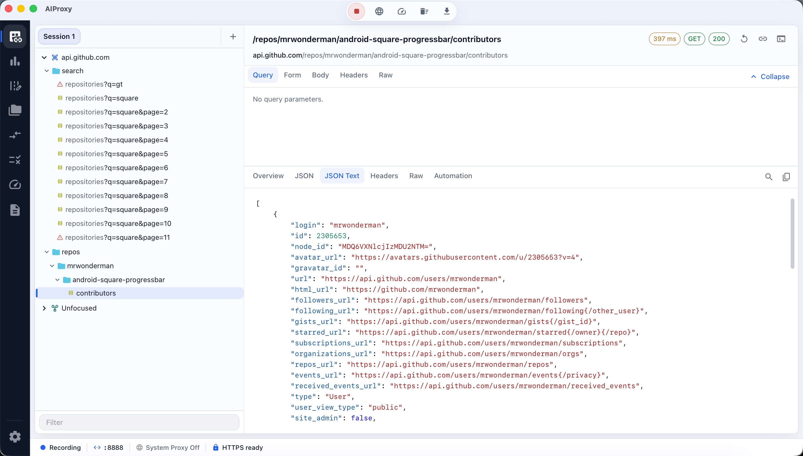
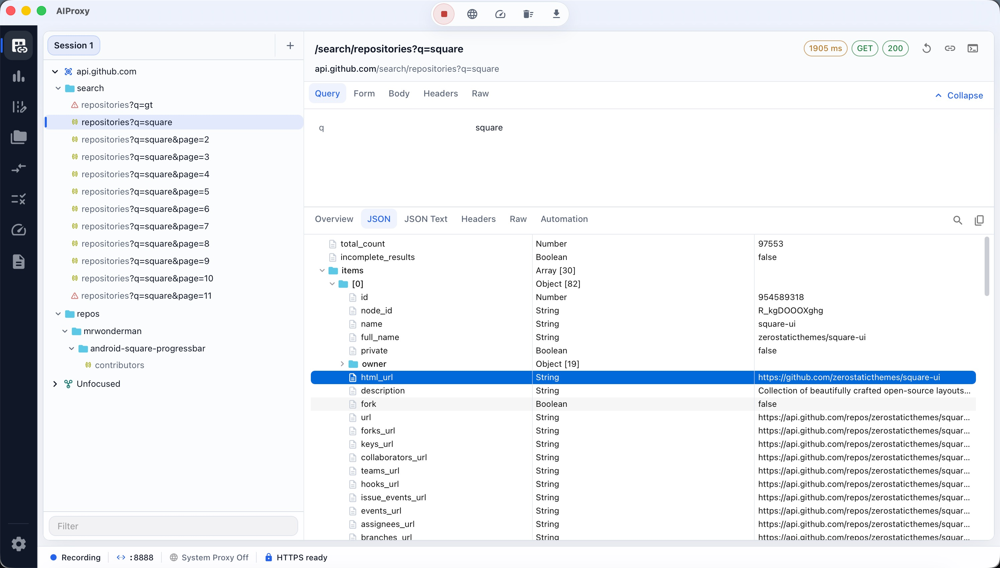
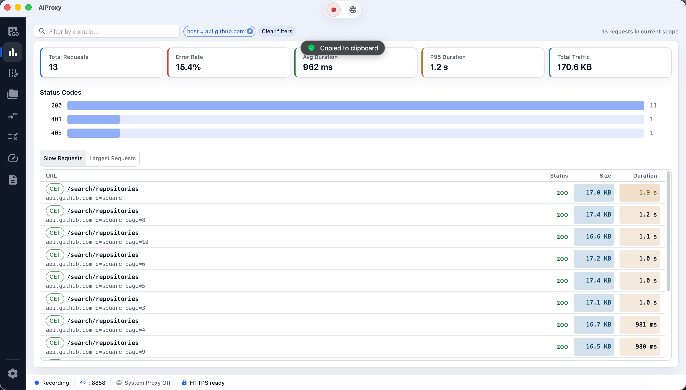

<div align="center">

# AIProxy

**面向开发者的现代跨平台代理调试工具。**

通过精致的 Material Design 桌面体验，抓取、检查和操控 HTTP / HTTPS / WebSocket 流量。

[English](./README.md) | [简体中文](./README.zh-CN.md)

[](https://github.com/small-dream/AIProxy/actions/workflows/ci.yml)
[](https://github.com/small-dream/AIProxy/actions/workflows/release.yml)
[](./LICENSE)
[](#平台支持)
[](https://tauri.app)
[](https://react.dev)
[](https://www.rust-lang.org)

</div>

---

## 📸 软件截图

### 流量检查器（暗黑主题）
三栏会话工作台 — 左侧按域名分组的流量浏览器，右侧带 JSON 语法高亮的请求/响应检查器。



### 流量检查器（浅色主题）
浅色主题下的同一套三栏会话工作台 — 请求/响应检查器，支持查询参数与 JSON 语法高亮。



### 流量洞察（浅色主题）
聚合分析仪表盘，包含概览卡片、分域名统计表格和状态码/请求方法分布图。



---

## ✨ 功能特性

### 抓包与检查
- 🔍 **全协议支持** — HTTP、HTTPS（MITM 解密）和 WebSocket
- 📱 **手机抓包** — 通过 Wi-Fi 抓取 iOS、Android、HarmonyOS 设备流量
- 🌐 **系统代理接管** — 全平台自动配置系统代理
- 📋 **丰富的会话视图** — 请求头、Body、时序、传输统计、JSON 高亮

### 规则与操控
- ✏️ **改写规则（Rewrite）** — 实时修改请求和响应
- 🗺️ **Map Local / Map Remote** — 将流量重定向到本地文件或不同服务器
- 🌐 **DNS 映射** — 覆盖 DNS 解析用于测试
- 📜 **脚本规则（Script）** — 基于 JavaScript 的请求/响应拦截（QuickJS 运行时）
- ⏸️ **断点（Breakpoint）** — 在请求/响应阶段拦截、检查、修改、Mock 或丢弃请求

### 开发者工具
- 🐌 **弱网模拟（Throttling）** — 可配置的弱网 Profile 与定向规则
- 📬 **构造与重发（Compose）** — 编辑并重新发送请求
- 📂 **集合（Collections）** — 保存、组织和批量执行请求，支持环境变量
- 🔀 **会话对比（Compare）** — 对比两个会话，发现行为差异
- 📊 **流量洞察（Insights）** — 聚合流量分析
- 🔐 **证书中心** — 根 CA 生成、信任管理与二维码手机配置

### 体验
- 🎨 **Material Design** — 简洁现代的 UI，支持浅色 / 暗黑 / 跟随系统主题
- 🌍 **双语国际化** — English 与 简体中文，默认跟随系统语言
- ⚡ **快速原生** — Rust 核心 + Tauri 2 外壳，不是又一个 Electron 应用

## 平台支持

| 平台 | 状态 |
|------|------|
| 🪟 Windows | ✅ 已支持 |
| 🍎 macOS | ✅ 已支持 |
| 🐧 Linux | ✅ 已支持 |

## 下载安装

预编译的二进制文件可在 [GitHub Releases](https://github.com/small-dream/AIProxy/releases) 页面下载。

> **注意：** 当前构建未签名。macOS 用浏览器下载后，Gatekeeper 会提示 **"已损坏，无法打开，应移至废纸篓"** —— 在新版 macOS 上「右键 → 打开」**无法**绕过此提示。请先将 `AIProxy.app` 拖到「应用程序」，再清除隔离属性即可正常打开：
>
> ```bash
> xattr -cr /Applications/AIProxy.app
> ```
>
> （路径按 app 实际位置调整，例如 `~/Downloads/AIProxy.app`。）Windows 的 SmartScreen 可能提示警告，点击"更多信息" → "仍要运行"即可。

## 快速开始（开发）

### 前置条件

- [Node.js](https://nodejs.org/) 22+
- [pnpm](https://pnpm.io/) 10+
- [Rust](https://www.rust-lang.org/tools/install)（stable）

### 初始化

```bash
# 克隆仓库
git clone https://github.com/small-dream/AIProxy.git
cd AIProxy

# 安装依赖
pnpm install

# 一次性系统依赖安装（安装 Tauri 前置依赖）：
#   macOS:   bash scripts/setup/setup-macos.sh
#   Linux:   bash scripts/setup/setup-linux.sh
#   Windows: powershell -ExecutionPolicy Bypass -File .\scripts\setup\setup-windows.ps1
```

### 运行

```bash
# 以开发模式启动桌面应用
pnpm desktop:run           # 自动识别平台
# 或显式指定：
pnpm desktop:run:macos
pnpm desktop:run:windows
pnpm desktop:run:linux
```

### 构建与打包

```bash
# 构建前端
pnpm build

# 生成分发包（.dmg / .msi / .AppImage 等）
pnpm desktop:bundle:macos
pnpm desktop:bundle:windows
pnpm desktop:bundle:linux
```

## 仓库结构

```text
apps/desktop/      Tauri 2 + React 19 桌面应用
  src/             前端源码（页面、功能、组件、i18n）
  src-tauri/       Rust Tauri 外壳 + 代理集成
crates/            Rust 核心模块
  proxy-core/      代理引擎（HTTP/HTTPS/WS 抓包、MITM）
  rule-engine/     改写 / Map / Script 规则执行
  tls-manager/     证书颁发与 TLS 管理
  db/              SQLite 持久化层
packages/          共享 TypeScript 包
  shared-types/    前后端共享契约
  ui-tokens/       设计令牌
docs/              架构与设计文档
scripts/           初始化、构建、发布脚本
```

## 质量校验

```bash
pnpm lint         # 全仓 ESLint
pnpm typecheck    # TypeScript 类型检查
pnpm test         # 前端测试（Vitest）
cargo fmt --all   # 格式化 Rust 代码
cargo clippy --workspace -- -D warnings   # Rust 代码检查
cargo test --workspace                     # Rust 测试
```

## 文档

- [产品需求文档 PRD](./docs/PRD.md)
- [架构文档](./docs/ARCHITECTURE.md)
- [API 规范](./docs/API_SPEC.md)
- [UI 规范](./docs/UI_GUIDELINES.md)
- [工程规范](./docs/ENGINEERING_GUIDELINES.md)
- [构建运行打包指南](./docs/BUILD_RUN_PACKAGE_GUIDE.md)
- [发布指南](./docs/RELEASE_GUIDE.md)
- [架构决策记录 ADR](./docs/DECISIONS/)

### 应用内用户指南

应用内的「文档」页面提供双语指南，涵盖 DNS 映射、弱网模拟、WebSocket 检查、脚本规则和集合使用。

## 国际化

AIProxy 提供完整的双语支持：

- **English** 与 **简体中文**
- 默认自动跟随系统语言
- 可在「设置 → 外观」中手动切换

前端采用自定义的类型安全 i18n 方案（无第三方库），具备编译时 key 校验。Rust 层使用 `rust-i18n` 处理原生菜单文案。设计思路详见 [ADR-001](./docs/DECISIONS/ADR-001-frontend-i18n.md)。

## 参与贡献

欢迎贡献！🎉

请阅读我们的[贡献指南](./CONTRIBUTING.md)开始参与。参与本项目即表示您同意遵守我们的[行为准则](./CODE_OF_CONDUCT.md)。

### 新手友好 issue

查看标记为 [`good first issue`](https://github.com/small-dream/AIProxy/labels/good%20first%20issue) 的 issue，适合新贡献者上手。

## 安全

发现安全漏洞？请查阅我们的[安全策略](./SECURITY.md)了解负责任的披露流程。**请不要为安全漏洞创建公开 issue。**

## 路线图

规划的功能和方向请见[六个月路线图](./docs/NEXT_6_MONTH_ROADMAP.md)。

## 技术栈

| 层级 | 技术 |
|------|------|
| 外壳 | Tauri 2 |
| 前端 | React 19、TypeScript、Vite 8 |
| UI | MUI 9（Material UI）、Emotion |
| 状态 | Zustand、TanStack Query |
| 路由 | React Router 7 |
| 核心 | Rust 2021 |
| i18n | 自定义类型安全方案（前端）、rust-i18n（Rust） |

## 开发期日志

桌面端开发构建会把结构化调试日志写入：

- 优先：`logs/dev/aiproxy-desktop-dev.log`
- 回退：`%TEMP%/aiproxy-dev/logs/dev/aiproxy-desktop-dev.log`

每次启动会自动清空旧日志，只保留本次运行。证书已信任时，启动按钮会以 HTTPS 解密模式启动代理。

## 许可证

[MIT](./LICENSE) © 2024-2026 small-dream

## 致谢

基于以下优秀的开源项目构建：[Tauri](https://tauri.app)、[React](https://react.dev)、[Rust](https://www.rust-lang.org)、[MUI](https://mui.com) 等。
