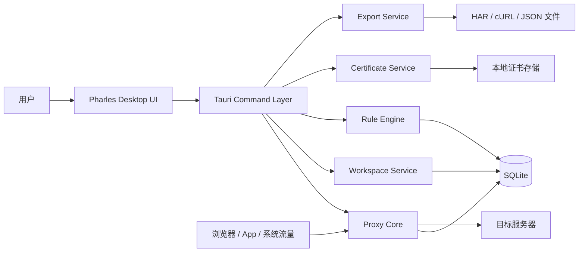
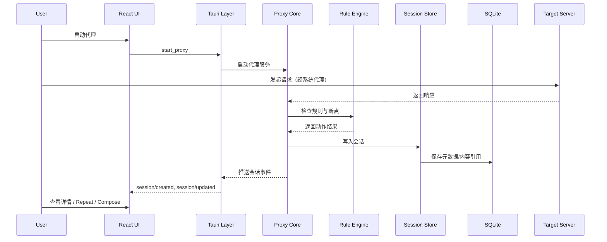
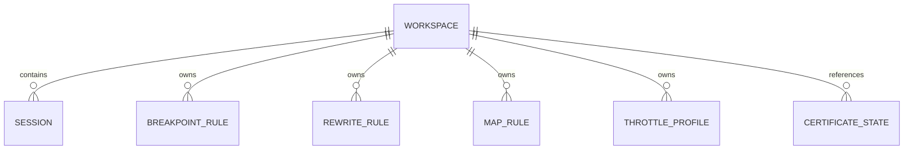

# Pharles Architecture

## 1. 文档信息

- 产品代号：`Pharles`
- 文档类型：系统架构文档
- 当前阶段：`Phase 1 / 初始化设计`
- 文档状态：`Draft v1.0`
- 配套需求文档：`docs/PRD.md`
- 配套接口文档：`docs/API_SPEC.md`
- 配套设计文档：`docs/UI_GUIDELINES.md`
- 配套工程规范：`docs/ENGINEERING_GUIDELINES.md`
- 配套页面蓝图：`docs/PAGE_BLUEPRINTS.md`

## 2. 架构目标

### 2.1 目标

- 构建跨平台桌面代理工具的稳定基础架构
- 明确 UI 层、桌面壳层、核心代理层、存储层边界
- 保证后续 AI 可以按模块、按文档、按类型安全迭代
- 支持从 MVP 演进到插件化和脚本化规则体系

### 2.2 架构原则

- **双文档驱动**：任何需求或实现变更先更新 `docs/PRD.md` 与 `docs/ARCHITECTURE.md`
- **强类型优先**：前端与桌面命令层使用 TypeScript，核心代理层使用 Rust
- **单一职责**：每个模块只解决单一问题，控制文件复杂度
- **可替换性**：规则引擎、导出器、存储层均可独立演进
- **AI 友好**：目录分层、命名稳定、边界清晰、测试可定位
- **工程规范前置**：代码实现默认遵循 `docs/ENGINEERING_GUIDELINES.md`

## 3. 技术选型

## 3.1 总体选型

- 桌面框架：`Tauri 2`
- 前端框架：`React 19`
- 前端语言：`TypeScript`
- 构建工具：`Vite`
- UI 框架：`Material UI (MUI)`
- 状态管理：`Zustand`
- 服务端状态：`TanStack Query`
- 路由：`React Router`
- 代理核心：`Rust`
- 本地数据库：`SQLite`
- E2E 测试：`Playwright`
- 前端单测：`Vitest + Testing Library`
- Rust 测试：`cargo test`

## 3.2 选型原因

### Tauri 2

- 适合跨平台桌面工具
- 资源占用低于 Electron
- 与 Rust 生态结合紧密，适合底层网络代理能力

### React + TypeScript

- 生态成熟，组件化与状态管理方案稳定
- 强类型约束利于 AI 生成与重构
- Material Design 生态完善，适合快速建立设计系统

### Rust

- 适合实现高性能代理、TLS、中间人证书与并发 IO
- 内存安全与跨平台一致性较强
- 能把网络核心与 UI 彻底解耦

### SQLite

- 本地桌面应用零运维
- 适合工作区、会话元数据、规则与配置存储
- 对 AI 设计 schema 与迁移极其友好

## 4. 系统上下文



## 5. 分层架构

### 5.1 表现层（Presentation Layer）

负责：

- 页面布局与导航
- 会话列表与详情展示
- 规则配置交互
- 用户输入校验与反馈

技术：

- React
- MUI
- Zustand
- TanStack Query

### 5.2 桌面接入层（Desktop Integration Layer）

负责：

- 封装前端到 Rust 的命令调用
- 管理系统代理、文件系统、证书安装入口
- 处理原生权限与平台差异

技术：

- Tauri commands
- Tauri events

### 5.3 领域服务层（Domain Services）

负责：

- 代理生命周期管理
- 请求/响应捕获
- 规则匹配与执行
- 会话持久化
- 弱网控制
- 导出能力

技术：

- Rust crates

### 5.4 基础设施层（Infrastructure）

负责：

- SQLite 持久化
- 文件读写
- 本地证书与配置文件管理
- 日志与错误上报

## 6. 核心模块设计

## 6.1 `proxy-core`

职责：

- 实现 HTTP / HTTPS / WebSocket 代理主流程
- 接管请求转发、响应返回与中间事件
- 对接断点、规则引擎、节流与会话记录

输入：

- 来自客户端的网络请求
- 来自工作区的代理配置

输出：

- 实时会话事件
- 请求/响应对象
- 错误与状态事件

## 6.2 `tls-manager`

职责：

- 生成根证书与中间证书
- 维护本地证书目录
- 检测平台信任状态
- 为 HTTPS 解密提供签发能力

## 6.3 `session-store`

职责：

- 将会话元数据写入 SQLite
- 将大体积请求/响应内容按策略落盘
- 提供搜索、过滤、排序、分页查询接口
- 在当前 MVP 阶段，桌面运行时内存中保留最近会话的 `summary + detail`，供 `Inspector` 快速读取

## 6.4 `rule-engine`

职责：

- 统一处理 Breakpoint、Rewrite、Map Local、Map Remote
- 执行规则匹配、优先级排序、动作派发
- 预留脚本化规则扩展点

## 6.5 `throttle-engine`

职责：

- 根据带宽、延迟、丢包配置影响请求或响应链路
- 支持启用、关闭与预设切换

## 6.6 `exporter`

职责：

- 导出 `HAR`
- 导出 `cURL`
- 导出自定义 JSON 会话包

## 7. 前后端交互设计

## 7.1 通讯模式

- **命令调用**：用于显式动作，例如启动代理、加载工作区、导出会话
- **事件推送**：用于实时流量与状态更新，例如新会话、会话更新、断点暂停、代理状态变化

## 7.2 关键命令示例

- `start_proxy`
- `stop_proxy`
- `get_proxy_status`
- `enable_system_proxy`
- `disable_system_proxy`
- `create_workspace`
- `load_workspace`
- `list_sessions`
- `get_session_detail`
- `repeat_session`
- `send_composed_request`
- `save_breakpoint_rule`
- `save_rewrite_rule`
- `save_map_rule`
- `set_throttle_profile`
- `export_sessions`
- `get_certificate_status`
- `install_certificate_guide`

## 7.3 关键事件示例

- `proxy/status_changed`
- `session/created`
- `session/updated`
- `session/removed`
- `breakpoint/paused`
- `rule/matched`
- `certificate/status_changed`

## 8. 数据流



## 9. 数据模型

## 9.1 实体关系



## 9.2 核心实体

### `workspace`

- `id`
- `name`
- `proxy_port`
- `ssl_enabled`
- `system_proxy_enabled`
- `storage_path`
- `created_at`
- `updated_at`

### `session`

- `id`
- `workspace_id`
- `protocol`
- `method`
- `host`
- `path`
- `url`
- `status_code`
- `request_headers`
- `request_body_ref`
- `response_headers`
- `response_body_ref`
- `start_time`
- `end_time`
- `duration_ms`
- `size_bytes`
- `client_ip`
- `server_ip`
- `pinned`
- `tags`

### `breakpoint_rule`

- `id`
- `workspace_id`
- `name`
- `enabled`
- `match_expression`
- `break_stage`
- `action_policy`
- `priority`

### `rewrite_rule`

- `id`
- `workspace_id`
- `name`
- `enabled`
- `match_expression`
- `rewrite_type`
- `rewrite_payload`
- `priority`

### `map_rule`

- `id`
- `workspace_id`
- `mode`
- `source_pattern`
- `target_value`
- `enabled`
- `priority`

### `throttle_profile`

- `id`
- `workspace_id`
- `name`
- `latency_ms`
- `upload_kbps`
- `download_kbps`
- `packet_loss_ratio`
- `enabled`

### `certificate_state`

- `id`
- `platform`
- `cert_path`
- `trusted`
- `fingerprint`
- `updated_at`

## 10. 存储策略

### 10.1 SQLite 存储内容

- 工作区
- 会话元数据
- 规则配置
- 弱网配置
- 应用设置

### 10.2 文件系统存储内容

- 根证书与密钥
- 会话大体积 Body
- 导出文件
- 工作区附属配置

### 10.3 存储设计原则

- 元数据入库，大体积内容按需落盘
- 数据库仅保存文件引用，避免单库膨胀
- 预留清理策略与归档策略

## 11. UI 架构

## 11.1 页面层级

- `SessionsPage`
- `ComposePage`
- `RulesPage`
- `CertificatesPage`
- `SettingsPage`

### 页面蓝图协同规则

- `docs/UI_GUIDELINES.md` 负责定义设计系统、布局规范、组件约束
- `docs/PAGE_BLUEPRINTS.md` 负责定义页面线框、组件树、状态模型、事件流
- `features/*` 下的页面实现必须同时对齐这两份文档
- 若页面结构调整影响前后端契约，需继续同步 `docs/API_SPEC.md`

### 页面结构映射

- `SessionsPage`：`Capture Control Strip` + `Session Explorer Pane` + `Session Inspector Workspace`
- `ComposePage`：`Preset Pane` + `Request Editor Pane` + `Response Result Pane`
- `RulesPage`：`Rule Type Switcher` + `Rule List Pane` + `Rule Editor Pane`
- `CertificatesPage`：`Certificate Status Card` + `Installation Guide Section` + `Risk / FAQ Section`
- `SettingsPage`：`Settings Navigation` + `Settings Content Pane`

## 11.2 功能模块拆分

- `session-list`
- `session-explorer`
- `session-detail`
- `compose-request`
- `breakpoints`
- `rewrite-rules`
- `map-rules`
- `throttling`
- `workspace-manager`

## 11.3 组件分层

- `components/ui`：基础原子组件封装
- `components/layout`：应用壳、导航、分栏容器
- `components/shared`：跨页面共享的复合组件
- `features/*`：按业务聚合页面逻辑、状态与视图

## 12. AI 友好型目录结构

```text
project-root/
├─ docs/
│  ├─ PRD.md
│  ├─ ARCHITECTURE.md
│  ├─ API_SPEC.md
│  ├─ UI_GUIDELINES.md
│  ├─ ENGINEERING_GUIDELINES.md
│  └─ DECISIONS/
├─ apps/
│  └─ desktop/
│     ├─ src/
│     │  ├─ app/
│     │  │  ├─ router/
│     │  │  ├─ providers/
│     │  │  └─ store/
│     │  ├─ pages/
│     │  ├─ features/
│     │  ├─ components/
│     │  ├─ hooks/
│     │  ├─ services/
│     │  ├─ lib/
│     │  ├─ types/
│     │  ├─ themes/
│     │  └─ test/
│     └─ src-tauri/
│        ├─ src/
│        │  ├─ commands/
│        │  ├─ bootstrap/
│        │  └─ main.rs
│        └─ tauri.conf.json
├─ crates/
│  ├─ proxy-core/
│  ├─ tls-manager/
│  ├─ session-store/
│  ├─ rule-engine/
│  ├─ throttle-engine/
│  └─ exporter/
├─ packages/
│  ├─ shared-types/
│  ├─ ui-tokens/
│  ├─ eslint-config/
│  └─ tsconfig/
├─ scripts/
├─ fixtures/
├─ .github/
├─ Cargo.toml
├─ pnpm-workspace.yaml
├─ package.json
└─ README.md
```

## 13. 目录职责说明

### `docs/`

记录需求、架构、API 规范、设计规范与架构决策，作为唯一事实源。

### `apps/desktop/`

承载桌面端 UI 与 Tauri 接入层。

### `crates/`

承载 Rust 领域模块，保证核心能力按单一职责拆分。

### `packages/shared-types/`

承载前后端共享类型与契约定义。

### `packages/ui-tokens/`

承载颜色、字号、间距与主题令牌。

### `fixtures/`

承载测试样本数据、规则样本与模拟会话。

## 14. 测试策略

### 14.1 单元测试

- 前端组件与 hooks 使用 `Vitest`
- Rust crate 按模块编写 `cargo test`

### 14.2 集成测试

- 验证代理启动、规则命中、会话写入与导出流程
- 验证 Tauri 命令层与 Rust 服务编排

### 14.3 E2E 测试

- 用 Playwright 验证核心交互路径
- 重点覆盖启动代理、查看会话、Compose、规则中心、导出

## 15. 可观测性与日志

- Rust 层记录结构化日志
- UI 层记录错误边界和关键行为埋点
- 调试模式下开放详细日志视图
- 预留匿名崩溃采集能力开关

### 15.1 开发期日志落点

- 优先写入仓库内：`logs/dev/pharles-desktop-dev.log`
- 若无法识别仓库根目录，则回退到：`%TEMP%\\pharles-dev\\logs\\dev\\pharles-desktop-dev.log`
- 前端额外保留控制台结构化日志，方便 UI 行为排查

### 15.2 日志覆盖范围

- `desktop.app`：应用启动、日志初始化、panic
- `desktop.commands`：`start_proxy`、`stop_proxy`、`enable_system_proxy`、`disable_system_proxy`
- `desktop.system_proxy.windows`：快照捕获、注册表写入、WinINet 刷新、恢复
- `proxy-core`：监听启动、监听停止、请求解析失败、请求转发成功、上游失败、CONNECT 拒绝
- `ui.commands`：前端命令发起、成功、失败

### 15.3 结构化字段要求

- 必须包含：`timestamp`、`level`、`component`、`event`
- 关键动作必须补充：`workspace_id / port / endpoint / client_addr / url / error`
- 请求体与响应体默认不完整落日志；若后续需要记录，必须脱敏和截断

### 15.4 开发期诊断流程

1. 确认 `start_proxy_requested` 和 `listener_started`
2. 确认 `enable_system_proxy_succeeded` 与系统代理写入日志
3. 访问 `http://neverssl.com`
4. 检查是否出现 `request_forwarded`
5. 若没有流量记录，优先排查系统代理是否真正接管；若有请求失败，优先看 `upstream_request_failed`

### 15.5 Inspector 详情链路

- `proxy-core` 负责采集请求头、响应头、请求体、响应体和基础 timing
- `desktop.commands` 通过 `get_session_detail` 暴露单条会话详情
- 前端 `Session Inspector Workspace` 按需查询详情，避免列表轮询时携带大体积 payload

## 16. 风险与演进建议

### 16.1 技术风险

- 系统代理切换受平台权限与系统策略影响
- HTTPS 证书信任流程跨平台复杂度高
- 不同客户端的证书锁定与协议实现会影响抓包能力

### 16.2 演进顺序

1. 先完成 HTTP/HTTPS 抓包与基础规则闭环
2. 再完善 WebSocket、导入导出与统计分析
3. 最后扩展脚本化规则与插件系统

## 17. 后续文档建议

建议下一步补充以下文档：

- `docs/API_SPEC.md`
- `docs/UI_GUIDELINES.md`
- `docs/DECISIONS/ADR-001-tauri-rust.md`
- `docs/DECISIONS/ADR-002-session-storage.md`
- `docs/DECISIONS/ADR-003-rule-engine.md`

## Runtime Safety Constraints

- Desktop shutdown must restore the previously captured system proxy snapshot before process exit.
- Proxy runtime shutdown and system proxy restoration must run even when the user closes the window directly instead of clicking in-app stop controls.
- Exit cleanup failures must be written to the structured desktop log for diagnosis.
