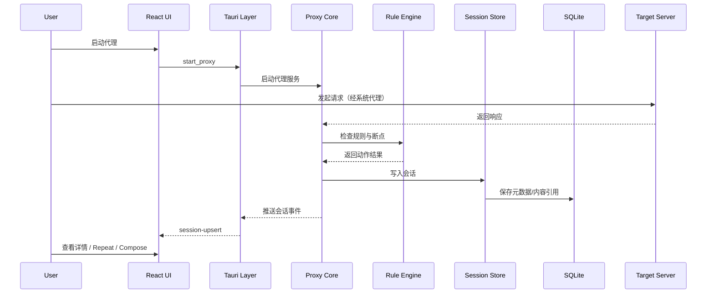
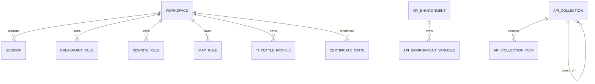

# AIProxy Architecture

## 1. 文档信息

- 产品代号：`AIProxy`
- 文档类型：系统架构文档
- 当前阶段：`P0 功能闭环 / 实现同步`
- 文档状态：`Living Spec v1.1`
- 配套需求文档：`docs/PRD.md`
- 配套接口文档：`docs/API_SPEC.md`
- 配套设计文档：`docs/UI_GUIDELINES.md`
- 配套工程规范：`docs/ENGINEERING_GUIDELINES.md`
- 配套页面蓝图：`docs/PAGE_BLUEPRINTS.md`

## 2. 架构目标

### 2.1 目标

- 构建跨平台桌面代理工具的稳定基础架构
- 明确 UI 层、桌面壳层、核心代理层、存储层边界
- 保证后续 AI 可以按模块、按文档、按类型安全迭代
- 支持从 MVP 演进到插件化和脚本化规则体系

### 2.2 架构原则

- **双文档驱动**：任何需求或实现变更先更新 `docs/PRD.md` 与 `docs/ARCHITECTURE.md`
- **强类型优先**：前端与桌面命令层使用 TypeScript，核心代理层使用 Rust
- **单一职责**：每个模块只解决单一问题，控制文件复杂度
- **可替换性**：规则引擎、导出器、存储层均可独立演进
- **AI 友好**：目录分层、命名稳定、边界清晰、测试可定位
- **工程规范前置**：代码实现默认遵循 `docs/ENGINEERING_GUIDELINES.md`

## 3. 技术选型

## 3.1 总体选型

- 桌面框架：`Tauri 2`
- 前端框架：`React 19`
- 前端语言：`TypeScript`
- 构建工具：`Vite`
- UI 框架：`Material UI (MUI)`
- 状态管理：`Zustand`
- 服务端状态：`TanStack Query`
- 路由：`React Router`
- 代理核心：`Rust`
- 本地数据库：`SQLite`
- E2E 测试：`Playwright`
- 前端单测：`Vitest + Testing Library`
- Rust 测试：`cargo test`

## 3.2 选型原因

### Tauri 2

- 适合跨平台桌面工具
- 资源占用低于 Electron
- 与 Rust 生态结合紧密，适合底层网络代理能力

### React + TypeScript

- 生态成熟，组件化与状态管理方案稳定
- 强类型约束利于 AI 生成与重构
- Material Design 生态完善，适合快速建立设计系统

### Rust

- 适合实现高性能代理、TLS、中间人证书与并发 IO
- 内存安全与跨平台一致性较强
- 能把网络核心与 UI 彻底解耦

### SQLite

- 本地桌面应用零运维
- 适合代理预设（底层兼容 workspace 模型）、会话元数据、规则与配置存储
- 对 AI 设计 schema 与迁移极其友好

## 4. 系统上下文

```mermaid
flowchart LR
    A[用户] --> B[AIProxy Desktop UI]
    B --> C[Tauri Command Layer]
    C --> D[Proxy Core]
    C --> E[Proxy Preset Service]
    C --> F[Rule Engine]
    Note: 运行时 manager 保留内存快照，启动时从 SQLite 恢复，写入时同步持久化
    C --> G[Certificate Service]
    C --> H[Export Service]
    D --> I[(SQLite)]
    E --> I
    F --> I
    G --> J[本地证书存储]
    H --> K[HAR / cURL / JSON 文件]
    L[浏览器 / App / 系统流量] --> D
    M[手机 / iOS / Android] --> D
    D --> N[目标服务器]
```

## 5. 分层架构

### 5.1 表现层（Presentation Layer）

负责：

- 页面布局与导航
- 会话列表与详情展示
- 规则配置交互
- 用户输入校验与反馈
- 国际化文案解析、语言偏好存储与系统语言跟随
- 外观主题解析、主题偏好存储与系统主题跟随

技术：

- React
- MUI
- Zustand
- TanStack Query

国际化约束：

- 前端通过 `I18nProvider` 统一提供文案解析能力
- `Settings` 页面管理应用级语言偏好：`system | zh-CN | en`
- `Settings` 页面管理应用级主题偏好：`system | light | dark`
- 翻译资源由前端静态消息表提供，不依赖远程拉取
- `system` 偏好通过 `navigator.languages / navigator.language` 解析生效语言
- `system` 主题偏好通过 `prefers-color-scheme` 解析最终主题
- 未命中支持语言时统一回退到 `en`

### 5.1.1 前端国际化子层

职责：

- 维护受支持语言列表与回退策略
- 管理翻译资源、插值与 key 类型约束
- 同步 `document.documentElement.lang`
- 为组件树提供 `t()`、当前语言和偏好设置能力
- 为组件树提供当前主题与主题偏好设置能力

设计要求：

- 用户可见文案禁止直接硬编码在页面组件中
- 消息资源按领域分组，避免单一超大字典文件
- 动态文案优先使用插值参数，避免业务组件内自行拼接多语言字符串

### 5.2 桌面接入层（Desktop Integration Layer）

负责：

- 封装前端到 Rust 的命令调用
- 管理系统代理、文件系统、证书安装入口
- 处理原生权限与平台差异

平台差异处理：

- 系统代理：Windows（注册表）、macOS（networksetup）、Linux（gsettings/kwriteconfig6）
- 证书信任检测：Windows（Powerhell/Cert store）、macOS（security verify-cert）、Linux（系统 CA 目录扫描）
- 证书安装器：Windows（rundll32）、macOS（Keychain Access）、Linux（xdg-open）

技术：

- Tauri commands
- Tauri events

### 5.3 领域服务层（Domain Services）

负责：

- 代理生命周期管理
- 请求/响应捕获
- 规则匹配与执行
- 会话持久化
- 弱网控制
- 导出能力

技术：

- Rust crates

### 5.4 基础设施层（Infrastructure）

负责：

- SQLite 持久化
- 文件读写
- 本地证书与配置文件管理
- 日志与错误上报

## 6. 核心模块设计

## 6.1 `proxy-core`

职责：

- 实现 HTTP / HTTPS / WebSocket 代理主流程
- 接管请求转发、响应返回与中间事件
- 对接断点、规则引擎、节流与会话记录
- 提供根 CA 证书下载端点 `GET /aiproxy-ca.crt`，供手机端扫码下载
- 默认绑定到 `0.0.0.0`（所有网络接口），支持局域网设备连接
- 内建 `BreakpointManager`，在请求转发前和响应返回前支持断点拦截与暂停 — `已实现`
- 内建 `DnsManager`，在代理管道的 5 个连接路径中提供 DNS 覆盖能力 — `已实现`
- 内建 `RewriteManager`，支持 Header / Query / Body / Redirect 改写，并记录会话级 rewrite trace — `已实现`
- 内建 `ScriptManager` + `aiproxy-rule-engine`，支持 JS/TS 单文件脚本在请求/响应阶段参与运行时处理 — `已实现`
- 内建 `WsConnectionRegistry`（全局 OnceLock），追踪活跃 WebSocket 连接并支持消息注入（重放） — `已实现`

DNS 覆盖实现机制：

- `DnsManager` 管理运行时 DNS 映射规则列表，按 workspace 隔离
- `resolve_dns_override()` 在连接上游前查询匹配的已启用规则，按优先级降序取第一个命中规则
- HTTP/HTTPS 转发路径（reqwest）：将 URL 中的 host 替换为覆盖 IP，保留原始 Host header
- TCP 直连路径（blind tunnel、WebSocket）：将 `TcpStream::connect` 目标替换为覆盖 IP
- TLS SNI 始终使用原始 hostname，不受 DNS 覆盖影响
- `send_direct_request`（Compose）不应用 DNS 覆盖，保持直接请求语义

Rewrite 规则实现机制：

- `RewriteManager` 管理运行时 Rewrite 规则列表，按 workspace 隔离
- 规则匹配条件包括 URL Pattern、HTTP Method、Stage、Enabled、Priority
- 请求阶段支持 Header、Query、Body、Redirect 改写
- 响应阶段支持 Header、Body 改写；Query 与 Redirect 在 UI 层做无效组合保护
- 命中的 Rewrite 会生成 `RewriteTrace`，包含 rule id/name、rewrite type、stage、outcome、duration、before/after entries
- Rewrite trace 通过 `rewrite_runs / rewrite_run_entries` 落库，并在 Session Inspector 的 `Automation` 标签页懒加载展示
- 响应体超过捕获限制时跳过响应改写，避免大文件热路径带来性能风险

脚本化规则实现机制：

- `aiproxy-rule-engine` 负责脚本规则模型、TS 转译、导出校验、QuickJS 沙箱执行与 trace 结构定义
- 保存规则时完成 `TypeScript -> JavaScript` 转译与 `onRequest / onResponse` 导出检查，运行时不再做热路径转译
- 请求链执行顺序：`Rewrite -> Map -> Script(onRequest) -> Breakpoint -> Throttle -> Upstream`
- 响应链执行顺序：`Upstream/Local Response -> Response Rewrite -> Script(onResponse) -> Breakpoint -> Throttle -> Client`
- `Map Local` 命中后跳过 `onRequest`，但仍执行 `onResponse`
- 脚本运行默认 `fail-open`，异常、超时或结果非法只记录 trace，不中断正常代理链
- 脚本日志与提取结果通过 `script_runs / script_run_entries` 落库，并在 Session Inspector 的 `Automation` 标签页懒加载展示
- `Automation` 标签页同时展示 Rewrite trace 与 Script trace；Rewrite trace 优先展示结构化 diff，Script trace 展示日志、提取结果和错误

断点实现机制：

- `BreakpointManager` 管理运行时断点规则列表和暂停中的请求映射
- 代理管道在每个连接的 tokio task 中，于 `forward_request` 前和 `write_upstream_response` 前各插入拦截检查
- 匹配规则时创建 `oneshot` 通道，代理 task await 接收端；前端通过 `resolve_breakpoint` 命令发送决策到发送端
- 支持三种决策：Forward（放行，可选修改 headers/body）、Drop（丢弃连接）、Mock（在请求阶段直接返回用户构造的响应）
- 事件推送通过框架无关的 `BreakpointEventEmitter` 回调实现，Tauri 层封装 `app_handle.emit()`

WebSocket 注入（重放）实现机制：

- `WsConnectionRegistry` 使用全局 `OnceLock<Mutex<HashMap<String, WsConnectionEntry>>>` 追踪所有活跃 WebSocket 连接，以 `session_id` 为键
- 每个 WS 升级建立中继时，创建 `mpsc::unbounded_channel`，将发送端注册到 Registry，接收端传入 `relay_websocket_frames()`
- 中继循环使用三路 `tokio::select!`：客户端帧、上游帧、注入通道帧
- 前端通过 `inject_ws_message` 命令将帧发送到 Registry，Registry 通过 channel 转交中继任务
- 注入帧遵循 RFC 6455 掩码规则：发往上游使用掩码（proxy as client），发往客户端不使用掩码（proxy as server）
- 中继结束时自动 `mark_closed` → `unregister`，并通过事件通知前端连接已关闭

输入：

- 来自客户端的网络请求（本机或局域网设备）
- 来自当前激活代理预设的代理配置（底层仍沿用 workspace 标识）

输出：

- 实时会话事件
- 请求/响应对象
- 错误与状态事件
- 根证书 PEM 文件（通过内建 HTTP 端点）

## 6.2 `tls-manager`

职责：

- 生成根证书与中间证书
- 维护本地证书目录
- 检测平台信任状态（Windows / macOS / Linux）
- 为 HTTPS 解密提供签发能力

平台信任检测实现：

- Windows：通过 PowerShell 查询 `Cert:\CurrentUser\Root` 和 `Cert:\LocalMachine\Root`
- macOS：通过 `/usr/bin/security verify-cert` 检查
- Linux：扫描 `/usr/local/share/ca-certificates/`（Debian/Ubuntu）和 `/etc/pki/ca-trust/source/anchors/`（RHEL/Fedora），通过 SHA-1 fingerprint 比对

## 6.3 `session-store`

职责：

- 将会话元数据写入 SQLite
- 将大体积请求/响应内容按策略落盘
- 提供搜索、过滤、排序、分页查询接口
- 在当前 MVP 阶段，桌面运行时内存中保留最近会话的 `summary + detail`，供 `Inspector` 快速读取

## 6.4 `rule-engine`

职责：

- 统一处理 Breakpoint、Rewrite、Map Local、Map Remote、DNS Mapping
- 执行规则匹配、优先级排序、动作派发
- 预留脚本化规则扩展点

## 6.5 `throttle-engine`

职责：

- 根据带宽、延迟、丢包配置影响请求或响应链路
- 支持全局 Profile 启用、关闭与预设切换
- 支持按 URL / Host / Method / Stage 命中的 Throttling Rule
- 生成 Session 级 Throttling Trace，用于解释延迟、传输耗时与丢包结果
- 维护运行期统计：命中请求数、丢包数、累计 request / response delay

## 6.6 `exporter`

职责：

- 导出 `HAR`
- 导出 `cURL`
- 导出自定义 JSON 会话包

## 7. 前后端交互设计

## 7.1 通讯模式

- **命令调用**：用于显式动作，例如启动代理、切换代理预设、导出会话
- **事件推送**：用于实时流量与状态更新，例如新会话、会话更新、断点暂停、代理状态变化

## 7.2 关键命令示例

- `start_proxy`
- `stop_proxy`
- `get_bootstrap_status`
- `enable_system_proxy`
- `disable_system_proxy`
- `create_workspace` — `已实现`，作为代理预设兼容命令，由 WorkspaceManager 创建内存记录并同步写入 SQLite
- `load_workspace` — `已实现`，按 ID 加载当前激活代理预设
- `list_workspaces` — `已实现`，返回所有代理预设列表（接口名保持兼容）
- `update_workspace` — `已实现`，部分更新代理预设字段
- `list_sessions`
- `get_session_detail`
- `repeat_session`（暂未实现，前端 Repeat 按钮替代）
- `send_composed_request` — `已实现`，Rust 端 `proxy-core::send_direct_request()` 发送请求，返回完整 `ProxySessionDetail`
- `list_breakpoint_rules` — `已实现`，返回当前断点规则列表
- `set_breakpoint_rules` — `已实现`，整体替换断点规则列表
- `resolve_breakpoint` — `已实现`，发送断点决策（forward/drop/mock）到暂停中的代理 task
- `save_breakpoint_rule`
- `save_rewrite_rule`
- `list_rewrite_session_trace` — `已实现`，返回指定 session 的 Rewrite 命中记录与 diff entries
- `save_map_rule`
- `list_dns_mappings` — `已实现`，返回指定 workspace 的 DNS 映射规则列表
- `save_dns_mapping` — `已实现`，新增或更新单条 DNS 映射规则
- `delete_rule` — `已实现`，支持 `ruleType: "rewrite" | "map" | "dns" | "script"`
- `list_throttle_profiles` / `save_throttle_profile` / `set_active_throttle_profile` — `已实现`，管理全局弱网 Profile
- `list_throttle_rules` / `save_throttle_rule` / `delete_throttle_rule` — `已实现`，管理定向弱网规则
- `list_throttle_session_trace` / `list_throttled_session_ids` / `get_throttle_runtime_stats` — `已实现`，提供弱网可解释性与运行统计
- `save_text_file` / `read_har_file` — `已实现`，当前导出由前端生成内容后写入下载目录，HAR 导入通过本地文件读取
- `get_certificate_status`
- `open_certificate_install_guide`
- `launch_certificate_installer`
- `list_android_adb_devices` / `install_android_certificate_via_adb` / `set_android_proxy_via_adb` / `clear_android_proxy_via_adb`
- `list_ios_simulators` / `install_ios_certificate_via_simulator`
- `get_local_ip`
- `list_api_collections` / `upsert_api_collection` / `delete_api_collection` / `move_api_collection`
- `list_api_collection_items` / `get_api_collection_item` / `upsert_api_collection_item` / `delete_api_collection_item` / `move_api_collection_item`
- `save_session_to_collection` / `batch_execute_collection_items`
- `list_api_environments` / `upsert_api_environment` / `delete_api_environment`
- `list_api_environment_variables` / `set_api_environment_variables`
- `list_api_global_variables` / `set_api_global_variables`

## 7.3 关键事件示例

- `session-upsert`
- `session-remove`
- `sessions-cleared`
- `sessions-removed`
- `breakpoint-hit` — `已实现`，代理管道在断点命中时向前端推送 `BreakpointHit` 载荷，包含 session ID、阶段、请求/响应详情
- `ws-message`
- `ws-connection-status`

## 8. 数据流



## 9. 数据模型

## 9.1 实体关系



## 9.2 核心实体

### `workspace` — 已实现（当前作为 Proxy Preset 数据模型）

- `id` — 默认预设为 `"default"`，新建预设为 `ws-{timestamp}-{random}`
- `name`
- `proxy_port`
- `ssl_enabled`
- `system_proxy_enabled`（预留，当前不可通过 API 修改）
- `storage_path`（预留，当前始终为空字符串）
- `created_at`
- `updated_at`

### `session`

- `id`
- `workspace_id`
- `protocol`
- `scheme`
- `http_version`
- `transport_protocol`
- `application_protocol`
- `method`
- `host`
- `path`
- `url`
- `status_code`
- `request_headers`
- `request_body_ref`
- `response_headers`
- `response_body_ref`
- `start_time`
- `end_time`
- `duration_ms`
- `size_bytes`
- `client_ip`
- `server_ip`
- `pinned`
- `tags`

### `breakpoint_rule`

- `id`
- `workspace_id`
- `name`
- `enabled`
- `match_expression`
- `break_stage`
- `action_policy`
- `priority`

### `rewrite_rule`

- `id`
- `workspace_id`
- `name`
- `enabled`
- `match_expression`
- `rewrite_type`
- `rewrite_payload`
- `priority`

### `rewrite_runs`

- `id`
- `session_id`
- `rule_id`
- `rule_name`
- `workspace_id`
- `rewrite_type`
- `stage`
- `outcome`
- `duration_ms`
- `created_at`

### `rewrite_run_entries`

- `id`
- `run_id`
- `kind`
- `key`
- `before_value`
- `after_value`
- `message`
- `seq`

### `map_rule`

- `id`
- `workspace_id`
- `mode`
- `source_pattern`
- `target_value`
- `enabled`
- `priority`

### `dns_mapping`

- `id`
- `workspace_id`
- `name`
- `host_pattern`
- `target_ip`
- `enabled`
- `priority`

### `throttle_profile`

- `id`
- `workspace_id`
- `name`
- `note`
- `enabled`
- `preset`
- `latency_ms`
- `upload_kbps`
- `download_kbps`
- `packet_loss_ratio`

### `throttle_rule`

- `id`
- `workspace_id`
- `name`
- `note`
- `enabled`
- `priority`
- `profile_id`
- `url_pattern`
- `methods`
- `stage`

### `throttle_run`

- `id`
- `session_id`
- `workspace_id`
- `profile_id`
- `profile_name`
- `rule_id`
- `rule_name`
- `stage`
- `outcome`
- `delay_ms`
- `latency_ms`
- `transfer_delay_ms`
- `body_bytes`
- `message`
- `sequence`
- `created_at`

### `certificate_state`

- `id`
- `platform`
- `cert_path`
- `trusted`
- `fingerprint`
- `updated_at`

### `api_collection` — 已实现

- `id` — UUID
- `parent_id` — 自引用，支持树形文件夹结构
- `name`
- `description`
- `sort_order`
- `created_at`
- `updated_at`

### `api_collection_item` — 已实现

- `id` — UUID
- `collection_id` — 外键，级联删除
- `name`
- `description`
- `sort_order`
- `method`
- `url`
- `headers` — JSON: `HeaderEntry[]`
- `body`
- `body_type` — `none | formdata | urlencoded | raw`
- `raw_language`
- `form_data` — JSON: `HeaderEntry[]`
- `url_encoded` — JSON: `HeaderEntry[]`
- `created_at`
- `updated_at`

### `api_environment` — 已实现

- `id` — UUID
- `name`
- `sort_order`
- `created_at`
- `updated_at`

### `api_environment_variable` — 已实现

- `id` — UUID
- `environment_id` — 外键，级联删除
- `key`
- `value`
- `enabled`
- `sort_order`

### `api_global_variable` — 已实现

- `id` — UUID
- `key`
- `value`
- `enabled`
- `sort_order`

## 10. 存储策略

### 10.1 SQLite 存储内容

> **当前状态**：会话元数据、代理预设、规则配置、API Collections、环境变量、弱网 Profile、弱网 Rule、Rewrite / Script / Throttling 执行记录已接入 SQLite；代理运行时仍会在内存中保留最近会话和各类 manager 快照，以保证 Inspector 与代理管线读写效率。

- 代理预设
- 会话元数据
- 规则配置
- 弱网 Profile 与作用范围规则
- API Collections、Collection Items、Environments、Environment Variables、Global Variables
- Throttling / Rewrite / Script 执行记录
- 应用设置

### 10.2 文件系统存储内容

- 根证书与密钥
- 会话大体积 Body
- 导出文件
- 代理预设附属配置（预留）

### 10.3 存储设计原则

- 元数据入库，大体积内容按需落盘
- 数据库仅保存文件引用，避免单库膨胀
- 预留清理策略与归档策略

## 11. UI 架构

## 11.1 页面层级

- `SessionsPage`
- `ComposePage`
- `CollectionsPage`
- `ComparePage`
- `RulesPage`
- `ThrottlingPage`
- `CertificatesPage`
- `SettingsPage`（含 Proxy Presets section）

### 页面蓝图协同规则

- `docs/UI_GUIDELINES.md` 负责定义设计系统、布局规范、组件约束
- `docs/PAGE_BLUEPRINTS.md` 负责定义页面线框、组件树、状态模型、事件流
- `features/*` 下的页面实现必须同时对齐这两份文档
- 若页面结构调整影响前后端契约，需继续同步 `docs/API_SPEC.md`

### 页面结构映射

- `SessionsPage`：`Sessions Header Toolbar`（Search / Clear / Export）+ `Session Explorer Pane` + `Split Resize Handle` + `Session Inspector Workspace` + `SessionContextMenu`；`SessionExportDialog` 处理 `Session Snapshot / HAR / cURL` 三类导出，右键菜单负责复制、重放、Host 聚焦 / 忽略与规则页跳转
- `ComposePage`：`SectionCard "Request Builder"`（Method/URL/Headers/Body/Query 编辑器）+ `SectionCard "Response Preview"`（复用 Inspector 组件渲染 Overview/Headers/Body/Timing），`Send` + `Export cURL` 工具栏按钮
- `CollectionsPage`：三栏布局 — `CollectionTreePane`（集合/文件夹树）+ `CollectionItemListPane`（请求列表）+ `CollectionItemEditorPane`（请求编辑器，复用 ComposeRequestSection + ComposeResponseSection）。底部环境选择器支持切换环境，变量替换引擎支持 `{{key}}` 语法
- `ComparePage`：独立 AI 对比工作台；顶部选择 Left / Right sessions，中间展示 summary / query / headers / body / timing diff，右侧 AI Summary 面板通过 `summarize_session_diff` 手动生成解释。AI payload 默认脱敏，模型配置来自 Settings 的 AI Model section
- `RulesPage`：顶层 `Rule Center` 卡片 + `Tabs` 切换规则域（Breakpoint / Rewrite / Mapping / Script）；`Mapping` 内部用分段控制切换 Map Local / Map Remote / DNS，规则编辑采用 `Rule List Pane` + `Rule Editor Pane`
- `ThrottlingPage`：`Runtime Status Bar` + 左侧 `Profiles / Rules` 切换列表 + 右侧 `Profile Editor / Rule Scope Editor`；支持全局 Profile、临时启用、一键关闭、按 URL / Method / Stage 定向规则
- `CertificatesPage`：`Certificate Status Card` + `Installation Guide Section` + `Risk / FAQ Section`
- `SettingsPage`：当前已实现 `Proxy Presets` + `AI Model` + `Language & Region` + `Appearance` 等设置区块；AI Model 使用本地 SQLite 保存 OpenAI-compatible 配置，API Key 不回传前端明文

## 11.2 功能模块拆分

- `session-list`
- `session-explorer`
- `session-detail`
- `session-actions` — `已实现首版`：SessionContextMenu + 按需 detail 拉取 + copy / compose / repeat / focus-ignore host / snackbar 反馈
- `compose-request` — `已实现`：ComposePage 页面 + use-compose-request hook + compose-editor.store + curl-export + EditableKeyValueTable
- `breakpoints` — `已实现`：BreakpointManager (Rust) + breakpoint.store + use-breakpoint-events hook + use-breakpoint-rules hook + BreakpointInterceptPanel + Rules 页面断点规则管理
- `rewrite-rules` — `已实现 P0/P1`：Rules 页面 Rewrite 工作台 + 场景模板 + 规则测试器 + Session 右键创建规则 + 会话级 rewrite trace/diff
- `map-rules` — `已实现首版`：Rules 页面 Map Local / Map Remote 工作台 + 命令层本地 fallback 持久化
- `dns-mappings` — `已实现`：Rules 页面 DNS tab + DnsMappingsPanel + DnsManager (Rust) + SQLite 持久化 + 代理管线 5 路径接入
- `throttling` — `已实现 P0/P1`：ThrottlingPage 工作台 + use-throttle-profiles hooks + 预设 / 自定义 Profile + 定向 Throttling Rule + Session 级 Throttling Trace + Runtime Stats + Sessions 过滤 / 右键创建规则
- `session-export` — `已实现首版`：SessionExportDialog + session-export.helpers + Sessions 页头导出入口；前端生成 Session Snapshot / HAR / cURL 内容后通过 `save_text_file` 写入下载目录
- `session-compare` — `已实现首版`：ComparePage + session-diff.helpers + redaction.helpers + Sessions 右键对比入口；支持 JSON path diff、文本行 diff、Header / Query 结构化 diff 与 AI 总结
- `ai` — `已实现首版`：`ai_settings` SQLite 表 + Rust `commands/ai.rs` + 前端 `services/commands/ai.ts`；支持 OpenAI-compatible Chat Completions、连接测试、diff 总结
- `collections` — `已实现`：CollectionsPage + collection-editor.store + use-collections hooks + use-collection-items hooks + CollectionTreePane + CollectionItemListPane + SaveToCollectionDialog
- `environments` — `已实现`：EnvironmentManagerDialog + VariableEditorTable + use-environments hooks（含全局变量支持）+ 变量替换引擎 `substituteVariables`
- `workspace-manager` — 代理预设管理模块，当前保留 workspace 命名以兼容共享类型与 Tauri/Rust 命令层

## 11.3 组件分层

- `components/ui`：基础原子组件封装
- `components/layout`：应用壳、导航、分栏容器
- `components/shared`：跨页面共享的复合组件
- `features/*`：按业务聚合页面逻辑、状态与视图

## 12. AI 友好型目录结构

```text
project-root/
├─ docs/
│  ├─ PRD.md
│  ├─ ARCHITECTURE.md
│  ├─ API_SPEC.md
│  ├─ UI_GUIDELINES.md
│  ├─ ENGINEERING_GUIDELINES.md
│  └─ DECISIONS/
├─ apps/
│  └─ desktop/
│     ├─ src/
│     │  ├─ app/
│     │  │  ├─ router/
│     │  │  ├─ providers/
│     │  │  └─ store/
│     │  ├─ pages/
│     │  ├─ features/
│     │  ├─ components/
│     │  ├─ hooks/
│     │  ├─ services/
│     │  │  ├─ commands/
│     │  │  │  ├─ index.ts
│     │  │  │  ├─ runtime.ts
│     │  │  │  ├─ proxy.ts
│     │  │  │  ├─ workspaces.ts
│     │  │  │  ├─ sessions.ts
│     │  │  │  ├─ compose.ts
│     │  │  │  ├─ rules.ts
│     │  │  │  ├─ throttling.ts
│     │  │  │  ├─ certificates.ts
│     │  │  │  ├─ collections.ts
│     │  │  │  ├─ environments.ts
│     │  │  │  ├─ files.ts
│     │  │  │  └─ ws.ts
│     │  │  └─ events/
│     │  ├─ lib/
│     │  ├─ types/
│     │  ├─ themes/
│     │  └─ test/
│     └─ src-tauri/
│        ├─ src/
│        │  ├─ commands/
│        │  │  ├─ mod.rs
│        │  │  ├─ common.rs
│        │  │  ├─ proxy.rs
│        │  │  ├─ workspaces.rs
│        │  │  ├─ sessions.rs
│        │  │  ├─ compose.rs
│        │  │  ├─ rules.rs
│        │  │  ├─ throttling.rs
│        │  │  ├─ certificates.rs
│        │  │  ├─ collections.rs
│        │  │  ├─ environments.rs
│        │  │  ├─ files.rs
│        │  │  └─ ws.rs
│        │  ├─ system_proxy/
│        │  │  ├─ mod.rs
│        │  │  ├─ windows.rs
│        │  │  ├─ macos.rs
│        │  │  ├─ linux.rs
│        │  │  └─ unsupported.rs (legacy, no longer compiled)
│        │  ├─ bootstrap/
│        │  └─ main.rs
│        └─ tauri.conf.json
├─ crates/
│  ├─ proxy-core/
│  ├─ tls-manager/
│  ├─ session-store/
│  ├─ rule-engine/
│  ├─ throttle-engine/
│  └─ exporter/
├─ packages/
│  ├─ shared-types/
│  │  └─ src/
│  │     ├─ index.ts
│  │     ├─ common.ts
│  │     ├─ proxy.ts
│  │     ├─ workspaces.ts
│  │     ├─ sessions.ts
│  │     ├─ compose.ts
│  │     ├─ rules.ts
│  │     ├─ throttling.ts
│  │     ├─ certificates.ts
│  │     ├─ collections.ts
│  │     ├─ environments.ts
│  │     └─ ws.ts
│  ├─ ui-tokens/
│  ├─ eslint-config/
│  └─ tsconfig/
├─ scripts/
├─ fixtures/
├─ .github/
├─ Cargo.toml
├─ pnpm-workspace.yaml
├─ package.json
└─ README.md
```

## 13. 目录职责说明

### `docs/`

记录需求、架构、API 规范、设计规范与架构决策，作为唯一事实源。

### `apps/desktop/`

承载桌面端 UI 与 Tauri 接入层。

### `crates/`

承载 Rust 领域模块，保证核心能力按单一职责拆分。

### `packages/shared-types/`

承载前后端共享类型与契约定义。

### 命令处理三层同构原则

为约束单文件复杂度并方便 AI 在三端定位同一业务域，命令处理统一按业务域（`ai / certificates / collections / compose / environments / files / proxy / rules / sessions / throttling / workspaces / ws`）在以下三层做一一对应的水平拆分：

- Rust 命令层：`apps/desktop/src-tauri/src/commands/<domain>.rs`，`mod.rs` 仅做 `mod` 声明与 `pub use` 汇聚，不写业务实现
- 前端命令客户端：`apps/desktop/src/services/commands/<domain>.ts`，`index.ts` 仅做 barrel re-export，`runtime.ts` 承载 `invokeCommand` 等基础设施
- 共享类型：`packages/shared-types/src/<domain>.ts`，`index.ts` 仅做 barrel re-export，`common.ts` 承载跨域复用的基础类型

新增命令时必须按业务域归位到对应模块，不允许在 `mod.rs` / `index.ts` 内直接添加实现；若新增独立业务域，三层必须同步建立同名模块。

### `packages/ui-tokens/`

承载颜色、字号、间距与主题令牌。

### `fixtures/`

承载测试样本数据、规则样本与模拟会话。

## 14. 测试策略

### 14.1 单元测试

- 前端组件与 hooks 使用 `Vitest`
- Rust crate 按模块编写 `cargo test`

### 14.2 集成测试

- 验证代理启动、规则命中、会话写入与导出流程
- 验证 Tauri 命令层与 Rust 服务编排

### 14.3 E2E 测试

- 用 Playwright 验证核心交互路径
- 重点覆盖启动代理、查看会话、Compose、规则中心、导出

## 15. 可观测性与日志

- Rust 层记录结构化日志
- UI 层记录错误边界和关键行为埋点
- 调试模式下开放详细日志视图
- 预留匿名崩溃采集能力开关

### 15.1 开发期日志落点

- 优先写入仓库内：`logs/dev/aiproxy-desktop-dev.log`
- 若无法识别仓库根目录，则回退到：`%TEMP%\\aiproxy-dev\\logs\\dev\\aiproxy-desktop-dev.log`
- 前端额外保留控制台结构化日志，方便 UI 行为排查

### 15.2 日志覆盖范围

- `desktop.app`：应用启动、日志初始化、panic
- `desktop.commands`：`start_proxy`、`stop_proxy`、`enable_system_proxy`、`disable_system_proxy`
- `desktop.system_proxy.windows`：快照捕获、注册表写入、WinINet 刷新、恢复
- `desktop.system_proxy.linux`：快照捕获、gsettings/kwriteconfig6 写入、恢复、桌面环境检测
- `proxy-core`：监听启动、监听停止、CONNECT 分流、TLS 握手、请求解析失败、上游请求开始 / 成功 / 失败、证书下载请求、断点请求阶段命中、断点响应阶段命中、断点取消
- `ui.commands`：前端命令发起、成功、失败

### 15.3 结构化字段要求

- 必须包含：`timestamp`、`level`、`component`、`event`
- 关键动作必须补充：`workspace_id / port / endpoint / client_addr / request_id / host / url / error`
- 请求体与响应体默认不完整落日志；若后续需要记录，必须脱敏和截断
- 开发日志按“单次运行”生命周期管理：应用启动时清空旧日志，仅保留当前会话

### 15.4 开发期诊断流程

1. 在 Certificates 页面完成根证书生成与信任
2. 确认 `start_proxy_requested`、`start_proxy_succeeded` 和 `listener_started`
3. 确认 `enable_system_proxy_succeeded` 与系统代理写入日志
4. 访问一个 `https://` 站点
5. 检查是否出现 `connect_received`、`connect_mitm_started`、`tls_handshake_succeeded`
6. 检查是否继续出现 `upstream_request_started`、`upstream_request_succeeded`、`https_request_forwarded`
7. 若没有流量记录，优先排查系统代理是否真正接管；若握手失败看 `tls_handshake_failed`；若上游失败看 `upstream_request_send_failed` / `https_upstream_request_failed`

### 15.5 Inspector 详情链路

- `proxy-core` 负责采集请求头、响应头、请求体、响应体和基础 timing
- `desktop.commands` 通过 `get_session_detail` 暴露单条会话详情
- 前端 `Session Inspector Workspace` 按需查询详情，避免列表轮询时携带大体积 payload

## 16. 风险与演进建议

### 16.1 技术风险

- 系统代理切换受平台权限与系统策略影响
- HTTPS 证书信任流程跨平台复杂度高
- Linux 桌面环境碎片化严重，当前仅覆盖 GNOME 和 KDE，其他环境（XFCE、Sway、i3 等）暂不支持系统代理切换
- 不同客户端的证书锁定与协议实现会影响抓包能力
- 代理绑定 `0.0.0.0` 会将代理和证书下载端点暴露给局域网内所有设备，需注意网络安全隔离

### 16.2 演进顺序

1. 先完成 HTTP/HTTPS 抓包与基础规则闭环
2. 再完善 WebSocket、导入导出与统计分析
3. 最后扩展脚本化规则与插件系统

## 17. 后续文档建议

建议下一步补充以下文档：

- `docs/API_SPEC.md`
- `docs/UI_GUIDELINES.md`
- `docs/DECISIONS/ADR-001-tauri-rust.md`
- `docs/DECISIONS/ADR-002-session-storage.md`
- `docs/DECISIONS/ADR-003-rule-engine.md`

## Runtime Safety Constraints

- Desktop shutdown must restore the previously captured system proxy snapshot before process exit.
- Proxy runtime shutdown and system proxy restoration must run even when the user closes the window directly instead of clicking in-app stop controls.
- Exit cleanup failures must be written to the structured desktop log for diagnosis.
