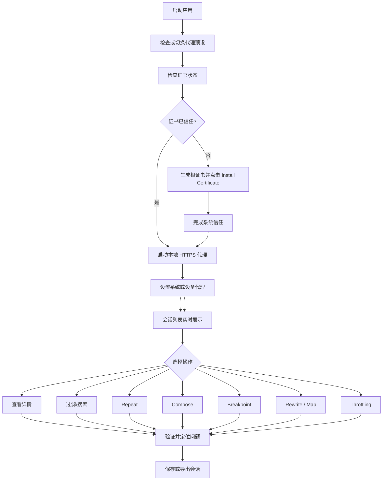

# AIProxy PRD

## 1. 文档信息

- 产品代号：`AIProxy`
- 文档类型：产品需求文档（PRD）
- 当前阶段：`P0 功能闭环 / 商业化前产品化`
- 文档状态：`Living Spec v1.1`
- 适用范围：桌面端跨平台代理抓包工具

## 2. 产品概述

### 2.1 产品定位

AIProxy 是一款面向开发者、测试工程师与平台团队的跨平台代理调试工具，核心目标是提供与 Charles 同等级别的 HTTP/HTTPS/WebSocket 抓包、分析、重放、改写与网络模拟能力，并以独立的 Material Design 桌面体验重构交互效率。

### 2.2 核心价值

- 一站式完成抓包、分析、改写、重放、Mock 与弱网模拟
- 降低 Web、移动端与桌面客户端的网络调试门槛
- 通过代理预设与规则中心提升团队协作与复现效率
- 用跨平台统一产品替代碎片化调试工具链

### 2.3 目标受众

- 前端工程师：定位接口、缓存、Cookie、跨域、静态资源问题
- 后端工程师：复现请求、观察 Header / Body / 状态码 / Timing
- 测试工程师：断点修改、Mock、弱网、回归验证
- 移动端工程师：抓取 App HTTPS 流量并分析会话内容
- 平台/安全工程师：做链路审计、代理诊断与协议层排障

## 3. 目标与边界

### 3.1 项目目标

- 在 `P0` 阶段完成可用的本地代理调试闭环
- 支持 Windows、macOS、Linux 三端一致体验
- 支持 HTTP、HTTPS、WebSocket 的核心抓包与分析能力
- 支持代理预设、规则、证书与会话存储等长期使用能力
- 支持中文、英文双语界面，并默认跟随系统语言

### 3.2 非目标

以下能力不纳入首个可交付版本：

- 云端协作平台
- SaaS 账号体系
- 企业级集中式策略下发
- 深度安全扫描与漏洞检测
- 全量替代 Postman / API 文档平台
- 反向代理（入站服务端 / Listen）模式：聚焦正向代理调试闭环，不做反向映射服务器
- Block / Allow List 域名级黑白名单：暂不纳入，屏蔽类需求由 Focus / Ignore 视图状态与 SSL 逐域名策略部分覆盖
- Repeat Advanced 高级重放（并发 N 次、编辑后批量重发）：编排类回放由 Scenario Replay 承接（见 `docs/NEXT_6_MONTH_ROADMAP.md` M5），不单独实现

## 4. 使用场景

### 4.1 场景一：接口调试

用户启动本地代理后设置系统代理，访问目标网页或 App，实时查看请求列表并定位失败请求，查看请求与响应体，必要时重发请求验证结果。

### 4.2 场景二：资源替换与 Mock

用户在规则中心配置 `Map Local`、`Map Remote` 或 `Rewrite` 规则，将远程资源映射为本地文件、测试环境地址或伪造响应，用于联调与前端开发。

### 4.3 场景三：边界行为验证

用户开启断点，在请求发送前或响应返回前暂停，修改 Header / Query / Body / 状态码，再决定放行或丢弃。

### 4.4 场景四：弱网与性能回归

用户启用带宽、延迟与丢包配置，模拟不同网络环境验证应用稳定性与加载体验。

## 5. 用户故事

### 5.1 P0（必须有）

#### US-001 启动代理

作为开发者，我希望一键启动本地代理并查看运行状态，以便立即开始调试网络请求。

#### US-002 系统代理管理

作为开发者，我希望在应用内快速开启或关闭系统代理，以减少手动配置成本。

#### US-003 HTTPS 解密

作为开发者，我希望安装并信任根证书后查看 HTTPS 明文流量，以定位真实业务接口问题。

#### US-004 会话列表抓包

作为开发者，我希望实时看到请求列表，包含方法、域名、路径、状态码、大小、耗时与协议，以便快速筛选问题请求。

#### US-005 会话详情查看

作为开发者，我希望查看请求/响应头、Body、Cookie、Query、Raw 与 Timing，以便完整分析链路细节。

#### US-006 搜索与过滤

作为开发者，我希望根据关键词、域名、方法、状态码等条件过滤请求，以便在高流量场景下快速定位目标。

#### US-007 重发请求

作为开发者，我希望对历史会话执行重复请求，以复现问题并验证修复。

#### US-008 构造请求

作为开发者，我希望手工编辑请求方法、URL、Header、Body 并发送，以便做接口验证与边界测试。

#### US-009 断点拦截

作为开发者，我希望在请求或响应阶段暂停并修改内容，再决定放行，以便调试复杂场景。

#### US-010 规则改写

作为开发者，我希望使用 Rewrite / Map Local / Map Remote 规则替换请求或响应内容，以支持联调、Mock 与资源调试。

#### US-011 DNS 映射

作为开发者，我希望将指定域名映射到自定义 IP 地址，以便在不修改代码或系统 hosts 文件的情况下切换后端环境、联调灰度服务或验证多环境部署。

#### US-012 会话保存与导出

作为开发者，我希望保存、导出和重新加载会话，以便复盘、共享和留档。

#### US-013 弱网模拟

作为测试工程师，我希望模拟不同网络条件，以验证应用在低速、高延迟和丢包环境下的表现。

### 5.2 P1（增强项）

- 代理预设模板与项目级配置（当前通过 Settings 中的 Proxy Presets 管理基础配置，模板共享待后续版本）
- WebSocket 消息查看、过滤与重发（当前已实现消息查看、搜索与活跃连接注入，WebSocket 脚本化仍为后续方向）
- 导入导出 `HAR`、`cURL`、`Postman`
- HTTP/2 会话捕获与展示 — `M3 已实现`：TLS ALPN `h2` 协商后将 stream 映射为 Session，展示 pseudo headers 与 trailers，设置页提供开关可回退 HTTP/1.1
- Protobuf body 解码与 gRPC-Web / Native gRPC 检查 — `M4 规划中`：descriptor set 导入、Raw / Hex / Decoded 视图、grpc-status / trailers 展示
- Scenario Replay 场景回放 — `M5 规划中`：从选中 sessions 生成回放场景，支持环境变量、顺序执行、断言与失败定位
- TypeScript 脚本化规则引擎（HTTP/HTTPS 请求与响应阶段，单文件脚本，严格沙箱，支持日志与数据提取）
- API Collections 与环境变量（当前已实现集合、请求项、从 Session 保存、变量替换与批量执行）
- 请求 / 响应 Diff 对比与 AI 总结（当前已实现发布硬化版：Compare 独立页面、Sessions 右键入口、OpenAI-compatible 模型配置、默认脱敏 AI payload、Body lazy diff、截断可见提示、body size guard 与 binary body 明确状态）
- 规则模板共享
- 轻量插件系统
- 流量统计与聚合分析面板 — `M2 已实现首版`：Insights 独立页面，支持概览卡片、Host 维度分析、状态码/方法分布、慢请求排名

## 6. MVP 范围

### 6.1 必做模块

- 代理启动 / 停止
- 系统代理开关
- 证书生成与信任指引
- 首次运行设置引导(首启向导 + 常驻设置清单):引导新用户走通"生成根证书 → 安装并信任 → 启动代理 → 开启系统代理/手动配置",完成口径以 `captureReady`(能抓到第一条 HTTPS 流量)为准;移动端/模拟器抓包(Android via adb / iOS via simctl / HarmonyOS NEXT via hdc)作为进阶可选步骤,自带 preflight 前置检查与排障闭环
- 会话捕获列表
- 请求详情与响应详情
- 搜索过滤
- Repeat
- Compose
- Breakpoints
- Rewrite / Map Local / Map Remote
- DNS 映射 / Host Override
- Throttling
- 会话持久化

### 6.2 可延后模块

- 插件系统
- 团队共享规则
- 云同步
- 高级脚本运行时（多文件工程、依赖管理、WebSocket 脚本化、外部能力扩展）

> 注：统计分析已在 M2 中以 Insights 页面形式实现首版，从可延后模块升级为已实现。

## 7. 业务流程

### 7.1 核心业务流

### 7.2 规则调试流程

## 8. 信息架构

### 8.1 一级导航

- Sessions
- Insights
- Compose
- Collections
- Compare
- Rules（统一承载 Breakpoints / Rewrite / Map Local / Map Remote / DNS Mapping / Script Rules）
- Throttling
- Certificates
- Settings
- Docs

### 8.2 主工作台结构

- 顶部：代理状态、代理预设切换、全局搜索、系统代理开关
- 左侧：一级功能导航
- 中间：抓包主工作台
- 主工作台左侧：按 `domain / host` 分组的树形会话浏览区，展开后展示请求项
- 主工作台右侧：当前选中请求的详情检查器
- 底部：代理状态栏与系统提示

### 8.3 国际化与语言策略

- 首批支持 `简体中文` 与 `English`
- 应用首次启动默认跟随系统语言
- 用户可在 `Settings` 中切换语言，并可恢复为“跟随系统”
- 所有核心页面、全局壳层、证书说明、会话检查器与规则配置文案均需支持双语
- 语言切换属于应用级偏好，不绑定代理预设

## 9. 功能需求明细

### 9.1 代理与抓包

- 可配置监听端口
- 支持启动、停止、重启
- 支持显示代理状态、证书状态、系统代理状态
- 支持 HTTP / HTTPS / WebSocket 捕获
- 支持 HTTP/2 捕获 — `已实现`：TLS ALPN 协商 `h2` 后将 HTTP/2 stream 映射为 Session，Inspector 展示 pseudo headers（斜体 + 标签）与 trailers；HAR 导出记录真实 HTTP version；设置页可关闭 HTTP/2 回退 HTTP/1.1 排障
- 支持上游（链式）代理：将抓包流量经由 HTTP CONNECT / HTTPS / SOCKS5 上游代理出网，适配「手机连 AIProxy 抓包、由本机规则代理负责实际出网」的场景；提供绕行列表与连通性测试，会话详情标注每条请求是直连还是经由上游代理
- 支持逐域名的 SSL 代理策略（对标 Charles SSL Proxying Settings）：include / exclude 两级列表决定哪些域名解密，未解密的域名仍正常盲转发。默认解密全部并预置一份已知使用证书绑定的域名排除表，使 TikTok、iCloud 等 App 在开启抓包时仍可正常使用

### 9.2 会话列表

- 支持实时流式追加
- 支持排序、搜索、过滤、清空、置顶、标记
- 默认以 `domain / host` 为一级分组展示
- 分组节点支持展开 / 收起，并显示该分组下的请求数量
- 组内请求项至少展示：方法、路径、状态码、耗时、协议、时间
- 在分组展开视图之外，预留切换到表格 / 平铺列表视图的扩展位

### 9.3 会话详情

- Overview
- Contents
- Request Headers / Body / Raw
- Response Headers / Body / Raw
- Query / Form / JSON 友好展示
- Cookies
- Timing（含 WaterfallChart 水平堆叠条形图，展示全部 7 个 timing 阶段）
- Timing 来源标识（`timingSource`）：区分代理捕获、Compose 发送和 HAR 导入的 timing 数据精度
- WebSocket 消息页签（P1 可先做只读）
- 详情区默认与当前树形列表选中请求联动，不允许出现“选中态丢失”

### 9.4 Compose / Repeat — `已实现`

- 从空白构建请求 — `已实现`：Compose 页面提供 Method、URL、Headers、Body 编辑器
- 从历史会话复制请求 — `已实现`：Sessions Inspector 摘要栏提供 "Repeat" 按钮，点击后预填数据并导航至 Compose 页面
- 编辑 URL、Method、Headers、Body — `已实现`：Method 下拉选择、URL 输入框、Headers/Query 可编辑键值表、Body 文本编辑器
- 查看发送结果与 Timing — `已实现`：响应预览复用 Inspector 组件（Overview/Headers/Body/Timing 标签页）
- 导出为 `cURL` — `已实现`：前端纯函数 `generateCurlCommand()` 生成 cURL 命令并复制到剪贴板

### 9.5 Breakpoints — `已实现`

- 支持请求阶段断点
- 支持响应阶段断点
- 支持查看与修改内容后放行
- 支持跳过、丢弃、Mock

实现说明：

- Rust 侧 `proxy-core` 提供 `BreakpointManager`，管理断点规则和暂停中的请求
- 代理管道在请求转发前和响应返回前各插入一个拦截点，使用 `tokio::sync::oneshot` 通道暂停 tokio 任务等待前端决策
- 前端通过 Tauri 事件 `breakpoint-hit` 接收拦截通知，通过 `resolve_breakpoint` 命令发送决策（forward/drop/mock）
- `BreakpointInterceptPanel` 组件以底部抽屉形式展示被拦截的请求/响应详情，支持编辑 headers 和 body
- Rules 页面提供断点规则管理：URL 子串匹配、方法过滤、阶段选择、启用/禁用
- 提供 "Break on All Requests" / "Break on All Responses" 快捷按钮一键开启全局断点
- HTTP 和 HTTPS (MITM) 路径均支持断点拦截
- 状态栏显示待处理断点计数指示器

### 9.6 Rewrite / Map

- Header 改写：支持 request / response 的 set / remove
- Query 改写：支持 request 阶段 set / remove
- Body 改写：支持 request / response 整段替换并设置 Content-Type，也支持字段模式按 JSON Path 修改/删除指定字段的值
- Redirect：支持 request 阶段目标 URL 改写，并可保留 path / query
- 本地文件映射
- 远程地址映射
- 优先级与启停控制
- Rewrite 命中日志与 before / after diff
- 从 Session 右键创建 Rewrite 规则草稿
- Rewrite 规则测试器：保存前验证 URL / Method / Stage 是否命中
- 无效组合保护：例如 response 阶段禁止 Query / Redirect

### 9.7 DNS 映射 — `已实现`

- 主机名模式匹配（子串匹配，非通配符展开；详见用户指南 DNS Mapping）
- 映射到自定义 IPv4 / IPv6 地址
- 规则按 workspace 隔离
- 优先级与启停控制
- 持久化到 SQLite，重启不丢失

实现说明：

- Rust 侧 `proxy-core` 提供 `DnsManager`，在代理管道的 5 个连接路径（HTTP forward、HTTPS blind tunnel、HTTP WebSocket、HTTPS WebSocket、HTTPS MITM）中解析 DNS 覆盖
- HTTP/HTTPS 转发通过 URL 重写实现（将 host 替换为覆盖 IP，保留原始 Host header）
- TCP 直连路径（blind tunnel、WebSocket）通过 `TcpStream::connect` 目标替换实现
- TLS SNI 保持原始 hostname，不受 DNS 覆盖影响
- Rules 页面 DNS tab 提供规则 CRUD，编辑器包含主机名模式和目标 IP 两个字段
- Compose 发送的直接请求不应用 DNS 覆盖，保持原始语义

当前交互落地：

- 统一收敛到 `Rules` 页面中的 `Rule Center`
- 通过 `Tabs` 切换 `Breakpoint / Rewrite / Map Local / Map Remote`
- `Rewrite` 采用“左侧规则列表 + 模板区 + 右侧 When / Then / Test 编辑器”的桌面工作台结构
- 新建 `Rewrite` 时优先提供面向场景的快捷模板，例如 Debug Header、Disable Cache、Env Query、Staging Redirect、Mock JSON
- Session Inspector 的 `Automation` 标签页统一展示 Rewrite trace / Script trace，Rewrite trace 优先展示结构化 diff
- `Map Local / Map Remote` 在同一编辑模型中强调来源模式、目标地址、保留路径、保留 Query
- 保存前使用自然语言预览最终效果，降低误配置风险

### 9.8 Throttling

- 预设网络配置
- 自定义上行、下行、延迟、丢包
- 全局启用与停用
- 按 URL / Host / Method / Stage 创建定向弱网规则
- 在 Session Automation 中展示弱网 Trace，解释是否命中、增加多少延迟、是否丢包
- Sessions 列表支持过滤被弱网影响的请求

当前交互落地：

- 作为独立一级页面 `Throttling`
- 顶部固定运行状态区，展示当前开关、命中数、丢包数、累计延迟，并提供临时启用 / 一键关闭
- 左侧通过 `Profiles / Rules` 切换预设、自定义配置和定向规则
- 右侧根据模式展示 Profile Editor 或 Rule Scope Editor
- Session 右键可以带入当前请求信息创建 Throttling Rule

### 9.9 会话导出

- 导出会话快照
- 导出 `HAR`
- 导出请求为 `cURL`

当前交互落地：

- 入口位于 `Sessions` 页面页头
- 通过对话框先选择范围：`当前选中 / 当前筛选 / 全部会话`
- 再选择格式：`会话快照 JSON / HAR / cURL`
- `JSON / HAR` 下载文件，`cURL` 复制到剪贴板
- 导出范围依赖当前 Sessions 视图上下文，不强制用户跳转页面

### 9.10 Collections — `已实现`

- 集合 / 文件夹树形管理，集合内保存请求项（复用 Compose 的请求/响应编辑组件）
- 从 Sessions 右键保存请求到集合
- 环境选择器与环境变量 / 全局变量管理，支持 `{{key}}` 变量替换
- 批量执行集合内请求并展示逐条结果
- 页面级结构见 `docs/PAGE_BLUEPRINTS.md` 第 10 节

## 10. 非功能需求

### 10.1 性能

- 首屏冷启动控制在合理桌面应用范围内
- 高并发抓包场景下 UI 不应明显卡顿
- 会话列表分页 / 虚拟滚动，避免大数据量阻塞界面

### 10.2 可用性

- 高频操作必须有快捷键
- 核心流程不超过 3 次主要操作即可启动抓包
- 亮/暗色主题统一可读

### 10.3 安全性

- 证书与私钥本地安全存储
- 对 MITM 能力进行明确风险提示
- 敏感信息展示与导出需预留脱敏能力

### 10.4 可维护性

- 所有需求变更先更新 `docs/PRD.md` 与 `docs/ARCHITECTURE.md`
- 功能模块边界清晰，便于 AI 与人工协同开发
- 前后端共享类型定义，降低契约漂移

## 11. 设计原则

- 功能对标 Charles，但不复制品牌与视觉资产
- UI 遵循 Material Design 3
- 优先保证调试效率，其次考虑装饰性视觉效果
- 让大多数任务在同一主工作台完成，减少页面切换
- 复杂规则可视化，避免过度脚本化导致学习成本升高

## 12. 风险与约束

- HTTPS 解密在不同平台上的证书信任链行为存在差异
- 系统代理修改权限因平台不同而存在限制
- WebSocket、HTTP/2、HTTP/3 支持难度不同：HTTP/2 捕获已实现（含回退开关），HTTP/3 / QUIC 明确延后（见 `docs/NEXT_6_MONTH_ROADMAP.md` P2），WebSocket 脚本化等深度能力仍分阶段推进
- 若涉及受保护 App 或证书锁定场景，抓包能力受客户端策略影响
- “1:1 功能对标”应理解为能力对标，而非品牌/UI 复制

## 13. 版本规划建议

里程碑排期、验收口径与优先级以 `docs/NEXT_6_MONTH_ROADMAP.md`（M1–M6）为唯一执行事实源；本节只保留粗粒度阶段映射，不另立版本规划。

### Phase 1（对应 M1，已完成）

- 完成本地代理核心闭环
- 支持基础规则、会话分析、证书管理、弱网模拟
- 可靠性与性能产品化：高流量渲染、大 body、导出稳定性

### Phase 2（对应 M2–M5，M2 / M3 已完成）

- 完成 WebSocket 深度支持
- 完成代理预设持久化与导入导出增强（当前通过 Settings 中的 Proxy Presets 管理基础配置）
- 增加轻量统计分析 — `已实现`：Insights 页面提供概览卡片、Host 分析、分布图和慢请求排名
- 完整 Timing 采集与 WaterfallChart — `已实现`：通过 hyper TimingConnector 采集全部 7 个 timing 阶段，WaterfallChart 水平堆叠条形图可视化
- HTTP/2 可用级捕获 — `已实现`（M3）
- Protobuf / gRPC-Web 检查、Collection 增强与 Scenario Replay（M4–M5，规划中）

### Phase 3（对应 M6 及之后）

- 文件级协作闭环（规则包 / 快照脱敏导入导出）与三端 Beta 发布（M6）
- 插件体系与团队协作规则共享（半年后再评估，明确延后项见 Roadmap P2）

## 14. 验收标准（Phase 1）

- 用户可在桌面端一键启动代理并设置系统代理
- 用户可完成 HTTPS 解密并查看明文请求/响应
- 用户可搜索、过滤、查看和保存会话
- 用户可执行 Repeat、Compose、Breakpoint 与基础 Rewrite
- 用户可启用弱网配置并观察效果
- Windows、macOS、Linux 均具备一致核心体验
